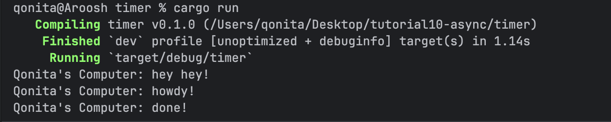
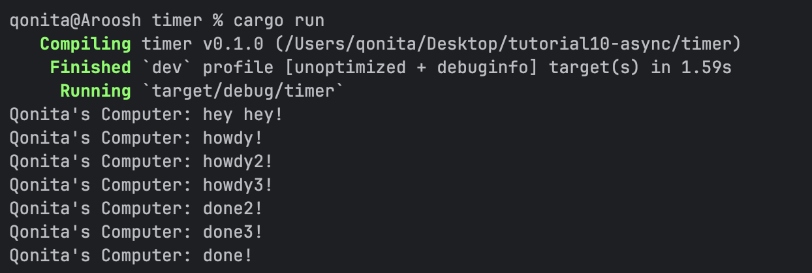
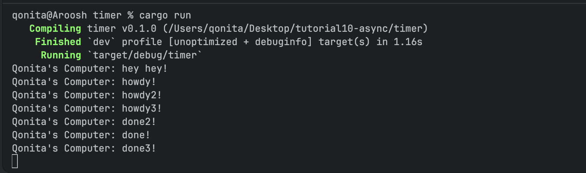
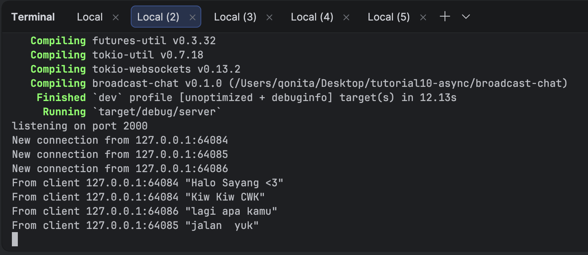
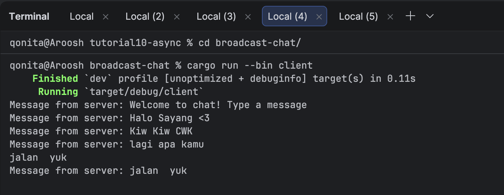
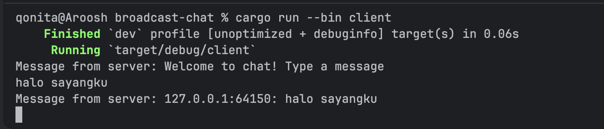
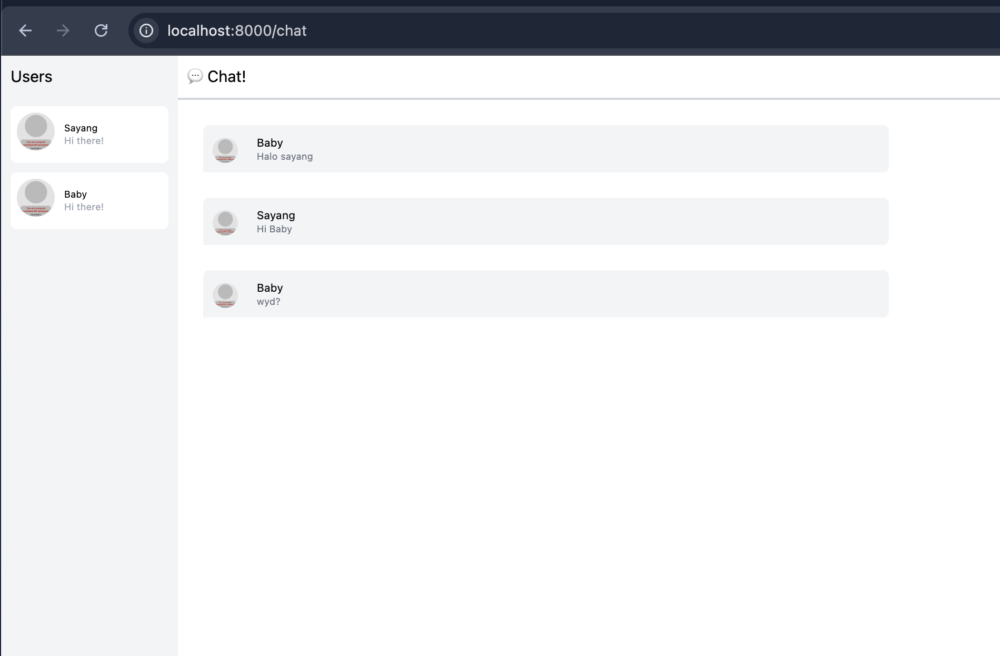
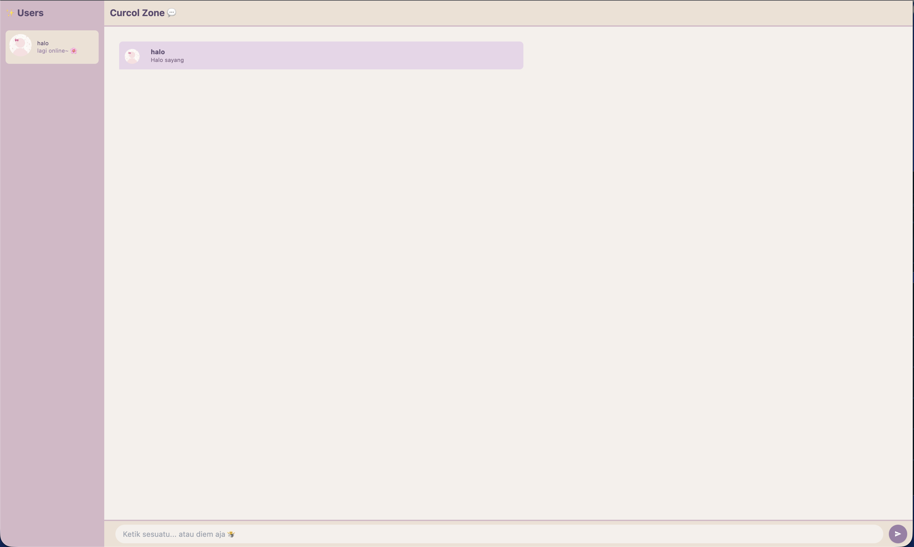

# Tutorial 10 - Asynchronous Programming

## Experiment 1.2: Understanding how it works

Output:

"hey hey!" muncul duluan sebelum "howdy!" padahal kodenya ditulis setelah spawn.
Ini karena spawn cuma mendaftarkan task ke antrian, belum langsung dijalankan.
Task baru beneran jalan waktu executor.run() dipanggil.
Jadi "hey hey!" di main thread langsung keeksekusi duluan, async task-nya nyusul belakangan.

## Experiment 1.3: Multiple Spawn and removing drop

### Multiple Spawn

Ketiga task jalan secara concurrent. howdy1, howdy2, howdy3 muncul berurutan,
tapi urutan done-nya tidak tentu karena ketiga task berjalan bersamaan dan selesai
sesuai jadwal masing-masing.

### Removing drop(spawner)

Tanpa drop(spawner), program tetap berjalan normal karena spawner otomatis di-drop
saat keluar dari scope main(). Fungsi drop(spawner) dipakai untuk memberi sinyal
ke executor bahwa tidak ada task baru lagi, sehingga executor tahu kapan harus berhenti.

## Experiment 2.1: Original code, and how it run

### Cara menjalankan:
- Jalankan server: `cargo run --bin server` di folder `broadcast-chat`
- Jalankan client (bisa lebih dari satu): `cargo run --bin client`

### Hasil:

Server menerima koneksi dari semua client dan mem-broadcast setiap pesan yang masuk
ke semua client yang terhubung. Jadi kalau satu client kirim pesan, semua client lain
bakal nerima pesan yang sama.

## Experiment 2.2: Modifying port

Port diubah dari 2000 ke 8080. Ada dua file yang perlu diubah:
- `src/bin/server.rs`: ubah port di `TcpListener::bind` dan println
- `src/bin/client.rs`: ubah port di `ClientBuilder::from_uri`

Keduanya menggunakan protokol websocket (`ws://`). Port harus sama di kedua sisi
karena client perlu konek ke port yang sama dengan yang di-listen server.

## Experiment 2.3: Small changes, add IP and Port

Modifikasi dilakukan di `server.rs` dengan mengubah format pesan yang dibroadcast
menjadi `{addr}: {text}` sehingga setiap pesan yang diterima client akan menampilkan
IP dan port pengirimnya. Ini berguna untuk tahu pesan itu datang dari client mana.

## Experiment 3.1: Original code

YewChat berhasil dijalankan di browser menggunakan Yew dan WebAssembly.
Cara menjalankan:
- SimpleWebsocketServer: `npm start` di folder SimpleWebsocketServer (port 8080)
- YewChat: `npm start` di folder YewChat (port 8000)

Dua user bisa chat satu sama lain dan pesan terbroadcast ke semua user yang terhubung.

## Experiment 3.2: Be Creative!

Modifikasi yang dilakukan:
- Tema warna diganti jadi dusty pink/lavender yang lebih aesthetic
- Judul "Chat!" diganti jadi "Curcol Zone 💬"
- Status user diganti dari "Hi there!" jadi "lagi online~ 🌸"
- Placeholder input diganti jadi "Ketik sesuatu... atau diem aja 🤷"
- Tambah fitur kirim pesan dengan tombol Enter
- Warna tombol send disesuaikan dengan tema